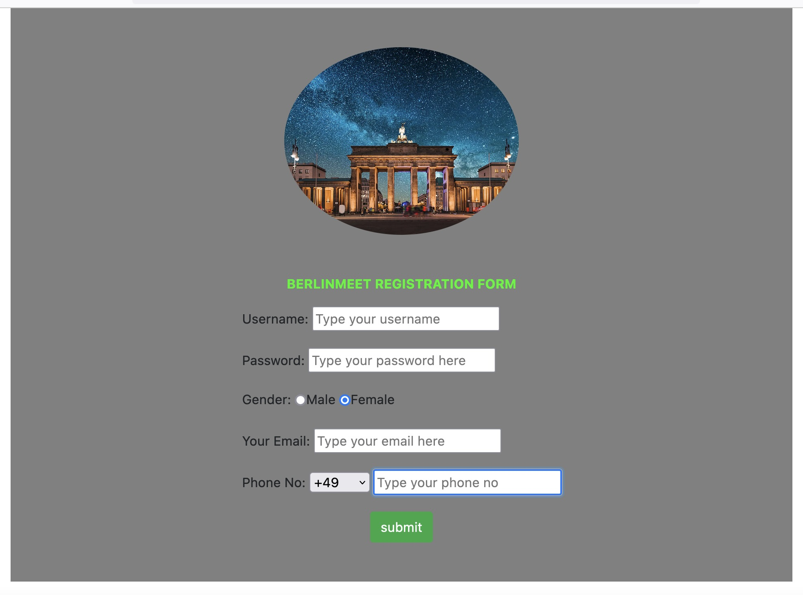
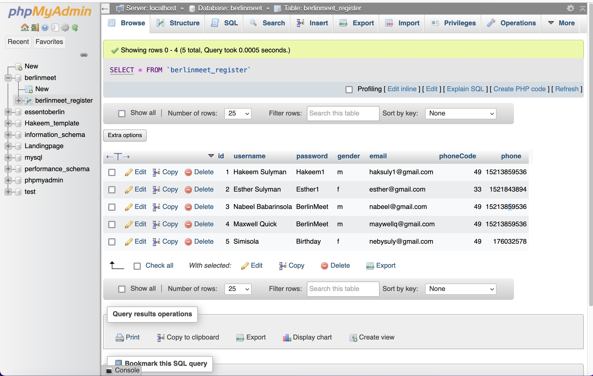

## SAMPLE EVENT REGISTRATION PAGE

#### This project is a simple demonstration of how a form on a website could be linked to a MYSQL database where details of form submissions could be accessed from a database. 

#### It is assumed that the project is to confirm attendance for an event in berlin.

#### Attendees visits a link (The project will be hosted via (NETLIFY) to register for the event.

## NOTE
#### The project could be configured to show the list of registered attendees to users when they visit the link to register. However, for this particular project, the details of registered attendees are only visible in the database.

## README
#### The README.md was implemented with Markdown (Auto Open Markdown Preview Extension for VSCode)

### PROCEDURES
> Set up project

> Implement form in project

> Connect form to database via php file in project

> Set up database vis phpMyAdmin

> Set up database and tables

## STACK & LINKS

[MySQL](https://dev.mysql.com/doc/apis-php/en/apis-php-introduction.html "MySQL")

[phpMyAdmin](https://www.phpmyadmin.net/ "phpMyAdmin")

[HTML](https://www.php.net/ "HTML")

[PHP](https://html.com/ "PHP")

[CSS](https://css-tricks.com/ "CSS")

## MARKDOWN

## PROJECT SCREENSHOT

          
        

## PROJECT DATABASE SCREENSHOT

          
        

